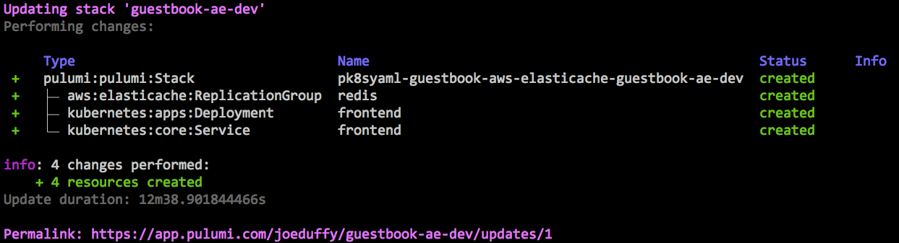

# Pulumi Kubernetes YAML Bridge (pk8syaml)


This library lets you deploy standard [Kubernetes YAML](https://kubernetes.io/docs/concepts/configuration/) files
using [Pulumi](https://pulumi.io).  This enables a few interesting scenarios

* Incremental adoption of real code for Kubernetes deployments
* GitOps-based CI/CD, using immutable infrastructure, for Kubernetes
* Ability to mix [AWS](https://pulumi.io/reference/aws.html), [Azure](https://pulumi.io/reference/azure.html),
  [Google Cloud](https://pulumi.io/reference/gcp.html) configuration alongside Kubernetes configuration

pk8syaml is published to NPM, and may be installed simply as

```
$ npm install pk8syaml
```

And then in your Pulumi program, simply point it at the desired YAML files

```javascript
'use strict';
let pk8syaml = require("pk8syaml");
pk8syaml.apply([
    "./path/to/some-kubernetes-config.yaml",
    ...,
    "./path/to/more-kubernetes-config.yaml",
]);
```

To use this library, make sure to [install Pulumi](https://pulumi.io/install) first.

## Examples

For a basic example of pk8syaml in action, see [the Standard Kubernetes Guestbook](./examples/guestbook).

To see an interesting mix of Kubernetes and cloud resources -- which can include
[AWS](https://pulumi.io/reference/aws.html), [Azure](https://pulumi.io/reference/azure.html), and
[Google Cloud](https://pulumi.io/reference/gcp.html) -- see
[this same Guestbook using hosted AWS ElastiCache](./examples/guestbook-aws-elasticache).  These are versioned
and deployed homogeneously.  Of course, it gets more interesting when you
[port the YAML configuration to real code](https://github.com/pulumi/examples/tree/master/kubernetes-ts-guestbook),
eliminating the need to do string substitution, and unlocking the full power of programming languages.


