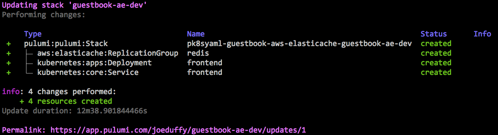
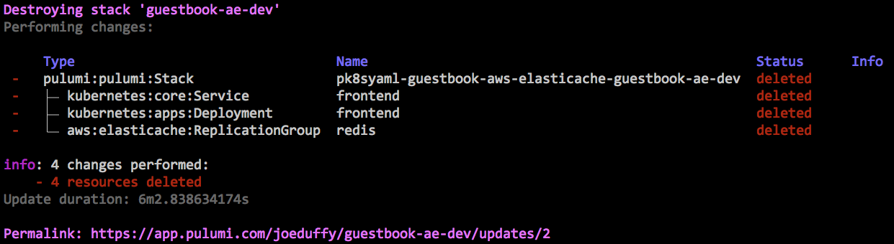

# Pulumi Kubernetes Guestbook w/ AWS ElastiCache

This sample extends the usual Kubernetes Guestbook example by using AWS ElastiCache for a hosted Redis cluster, rather
than provisioning one manually.  This lets you manage both Kubernetes and AWS resources with a single tool, Pulumi.

Using a native AWS service also has some added benefits, including auto-scaling, simpler hosting and configuration
of the control plane, integration with AWS's networking features such as subnets and VPCs, easy upgrades of machine
sizing, and automatic backup snapshotting.

This leverages the pk8syaml library to use the Kubernetes YAML configuration mostly as-is, substituting the
Redis address auto-assigned by AWS ElastiCache.  pk8syaml is meant to make it easy to port programs incrementally.
More of the program could be rewritten in a real language, for example, as in
https://github.com/pulumi/examples/tree/master/kubernetes-ts-guestbook.

This example is obviously just that, an example, but hopefully it is thought provoking.

## Prerequisites

1. Download the Pulumi CLI from https://pulumi.io/, or simply by running

    ```bash
    $ curl -fsSL https://get.pulumi.com/ | sh
    ```

2. Configure Pulumi to connect to your Kubernetes cluster.  Detailed instructions can be found
    [here](https://pulumi.io/install/kubernetes.html), however if `kubectl` is already configured,
    you should already be good to go.

3. Configure Pulumi to connect to your AWS account.  Detailed instructions can be found
    [here](https://pulumi.io/install/aws.html), however if the AWS CLI is already configured,
    you should already be good to go.

## Running This Example

1. Clone this repo, install dependencies using NPM (or Yarn)

    ```bash
    $ git clone https://github.com/joeduffy/pk8syaml
    $ cd pk8syaml/examples/guestbook-aws-elasticache
    $ npm install
    ```

2. Create a new [stack](https://pulumi.io/tour/programs-stacks.html) to deploy into

    ```bash
    $ pulumi stack init guestbook-ae-dev
    ```

3. Configure the AWS region to deploy AWS ElastiCache into

    ```bash
    $ pulumi config set aws:region us-west-2
    ```

4. Deploy!

    ```bash
    $ pulumi up
    ```

    

5. Marvel at the fact that AWS resources and Kubernetes are now co-existing in harmony!  Try making some edits and
   running `pulumi up`, it will figure out the minimal set of changes to be made, and orchestrate them automatically.
   Rinse, repeat.

6. To clean up after you're done, run

    ```bash
    $ pulumi destroy --yes
    $ pulumi stack rm --yes
    ```

    
