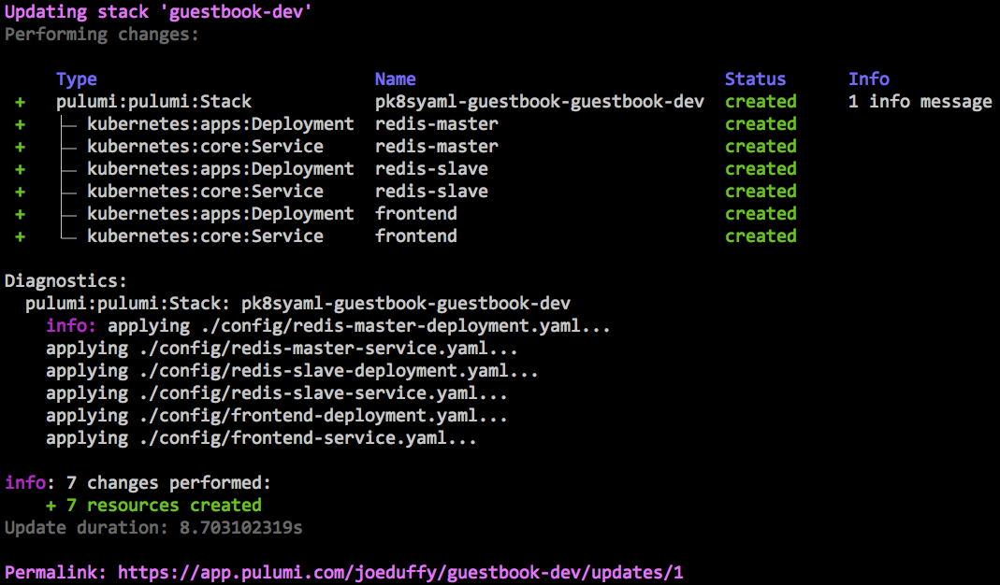
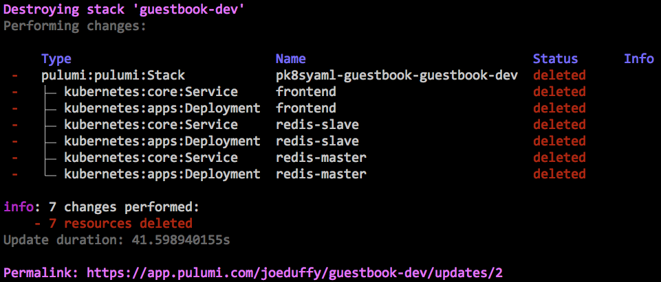

# Pulumi Kubernetes Guestbook

This example demonstrates using the pk8syaml library to provision Kubernetes resources, authored in standard
Kubernetes YAML, using the Pulumi toolchain.

Although you can use your favorite language -- JavaScript, TypeScript, Python, etc. -- to write such programs using
Pulumi, the pk8syaml library offers a simple way to get started.

For instance, https://github.com/pulumi/examples/tree/master/kubernetes-ts-guestbook contains a version written
entirely in TypeScript.  By using pk8syaml, you can convert one piece at a time, incrementally leveraging Pulumi.

## Running This Example

1. Clone this repo, install dependencies using NPM (or Yarn)

    ```bash
    $ git clone https://github.com/joeduffy/pk8syaml
    $ cd pk8syaml/examples/guestbook
    $ npm install
    ```

2. Download the Pulumi CLI from https://pulumi.io/, or simply by running

    ```bash
    $ curl -fsSL https://get.pulumi.com/ | sh
    ```

3. Configure Pulumi to connect to your Kubernetes cluster.  Detailed instructions can be found
    [here](https://pulumi.io/reference/kubernetes.html#configuration), however if `kubectl` is already configured,
    you should already be good to go.

4. Create a new [stack](https://pulumi.io/tour/programs-stacks.html) to deploy into

    ```bash
    $ pulumi stack init guestbook-dev
    ```

5. Deploy!

    ```bash
    $ pulumi up
    ```

    

6. Marvel at your shiny new Kubernetes Guestbook...  Try making some edits and running `pulumi up`, it will
   figure out the minimal set of changes to be made, and orchestrate them automatically.  Rinse, repeat.

7. To clean up after you're done, run

    ```bash
    $ pulumi destroy --yes
    $ pulumi stack rm --yes
    ```

    
